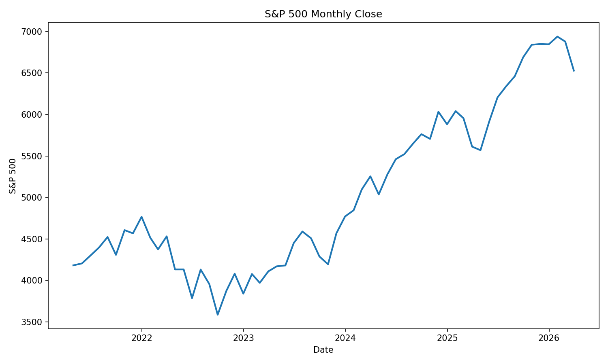
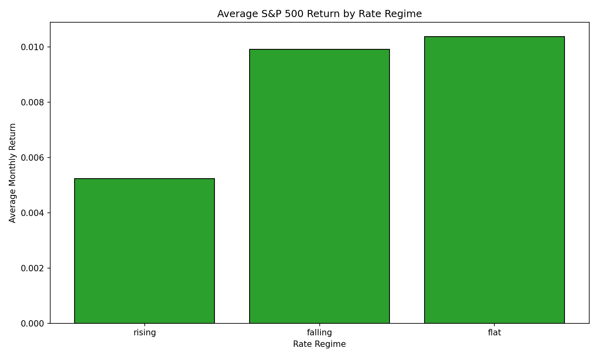
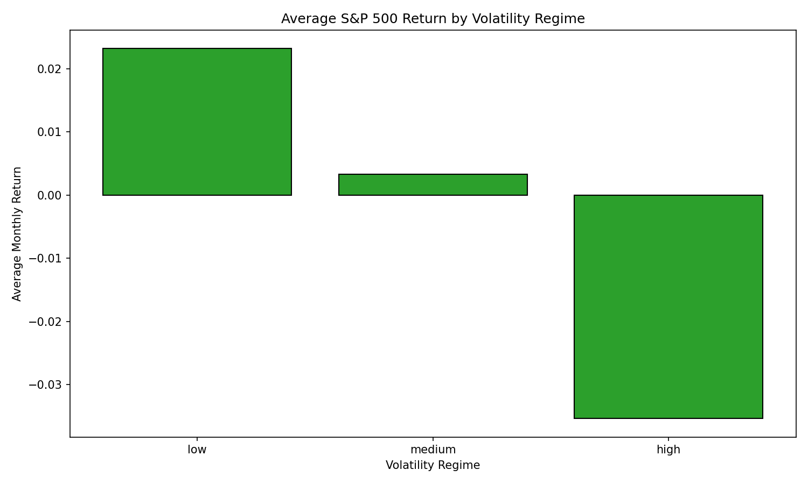

# Finance Project: FRED Macro-Financial Analysis

[Lithuanian version](README-lt.md)

## Project Overview
This project builds a monthly macro-financial dataset from FRED data, stores it in SQLite, and analyzes how S&P 500 returns relate to interest rates, inflation, and market volatility.

### Business / Problem Statement
Investors and analysts need a reliable way to compare equity performance, interest rates, inflation, and volatility on a common monthly timeline. This project helps identify how the S&P 500 behaves during rising and falling interest-rate cycles, inflation regimes, and volatility regimes.

## Dataset Description
The project uses FRED-sourced CSV files in the `data/` folder:
- `sp500.csv` — daily S&P 500 closing values
- `fedfunds.csv` — monthly federal funds rate values
- `cpi.csv` — monthly CPI urban consumer price index values
- `vix.csv` — daily VIX closing values

The code standardizes dates, converts daily series to month-end values, and merges all series into a single monthly dataset.

Data source: Federal Reserve Economic Data (FRED).

## Tools Used
- Python 3
- pandas
- sqlite3
- matplotlib
- standard Python libraries (`pathlib`)

## Project Structure
```
project_root/
├── data/
│   ├── cpi.csv
│   ├── fedfunds.csv
│   ├── sp500.csv
│   └── vix.csv
├── output/
│   ├── fred_monthly_merged.csv
│   ├── finance_project.db
│   └── charts/
├── sql/
│   └── analysis_queries.sql
├── notebooks/
│   └── finance_analysis.ipynb
├── src/
│   ├── data_cleaning.py
│   ├── database_build.py
│   └── analysis.py
├── .gitignore
├── LICENSE
├── README.md
├── README-lt.md
└── requirements.txt
```

## Output Summary
- `output/fred_monthly_merged.csv` — cleaned monthly dataset
- `output/finance_project.db` — generated SQLite database table `fred_monthly_data` (ignored by Git)
- `output/charts/` — PNG charts generated by `src/analysis.py`

## Data Cleaning Summary
The cleaning workflow in `src/data_cleaning.py`:
- loads each CSV with `pandas`
- standardizes `observation_date` to `date`
- uses `SP500` and `VIXCLS` as daily series
- converts daily series to month-end values using the last available trading-day close
- uses monthly CPI and federal funds data as month-end values
- drops months missing any of the four core series
- adds analytical columns:
  - `sp500_pct_change`
  - `inflation_pct_change` (year-over-year CPI change)
  - `rate_change`
  - `rate_regime` (`rising`, `falling`, `flat`)
  - `volatility_regime` (`low`, `medium`, `high`)

Percentage-change columns are stored as decimal values, where `0.01` equals `1%`.
VIX regimes are simple analytical categories: `low` is below 18, `medium` is 18 to below 25, and `high` is 25 or above.

## SQL Analysis Summary
The SQL file `sql/analysis_queries.sql` includes queries for:
- full dataset preview
- date filtering
- average S&P 500 returns by year
- rate-regime return analysis
- inflation vs equity return comparison
- volatility regime performance
- combined rate and volatility regime performance

## How to Run the Project Locally
1. Install dependencies:
```bash
python -m pip install -r requirements.txt
```
2. Build the cleaned monthly dataset:
```bash
python src/data_cleaning.py
```
3. Create the SQLite database:
```bash
python src/database_build.py
```
4. Run the analysis and generate charts:
```bash
python src/analysis.py
```
5. Open `notebooks/finance_analysis.ipynb` for an interactive review.

## Key Findings
- The cleaned dataset covers April 2021 through March 2026 and supports 60 monthly observations.
- Average monthly S&P 500 return is positive in most full years, with 2022 and 2026 showing negative average monthly performance.
- Rising Fed Funds regimes produced lower average monthly S&P 500 returns (~0.52%) than falling or flat rate regimes (0.99% and 1.04%, respectively).
- Low volatility months generated the strongest average monthly returns (about 2.32%), while high volatility months delivered negative average returns (about -3.54%).

## Chart Preview




## What the Charts Show
- `sp500_over_time.png` shows the monthly S&P 500 trend and the equity market path over the sample period.
- `fedfunds_over_time.png` visualizes how the Fed Funds rate evolved across tightening and easing cycles.
- `cpi_over_time.png` illustrates CPI inflation momentum through the same monthly horizon.
- `vix_over_time.png` highlights market volatility regimes and spikes in risk sentiment.
- `sp500_vs_fedfunds.png` compares equity returns with interest-rate levels, making regime effects visible.
- `sp500_vs_inflation.png` shows the relationship between monthly equity returns and inflation pressure.
- `avg_return_by_rate_regime.png` demonstrates the average S&P 500 return in rising, falling, and flat rate periods.
- `avg_return_by_volatility_regime.png` highlights how low, medium, and high VIX regimes map to average equity returns.

## Future Improvements
- add a portfolio-level risk-return comparison with drawdown metrics
- incorporate additional macro factors such as unemployment or GDP
- extend the dataset with dividend-adjusted equity returns
- implement automated backtesting for regime-based asset allocation
